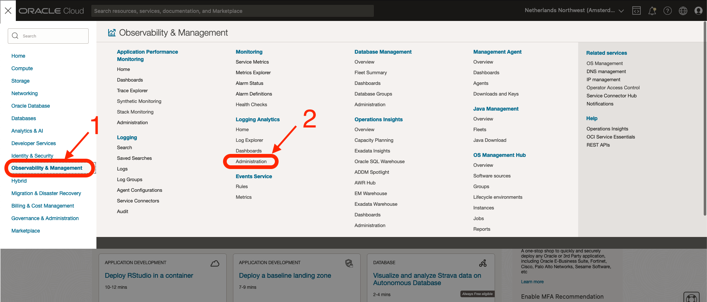
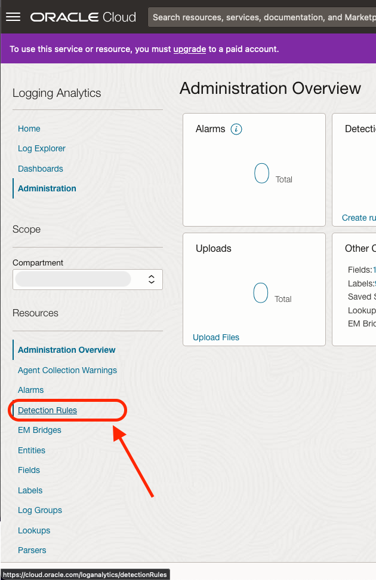
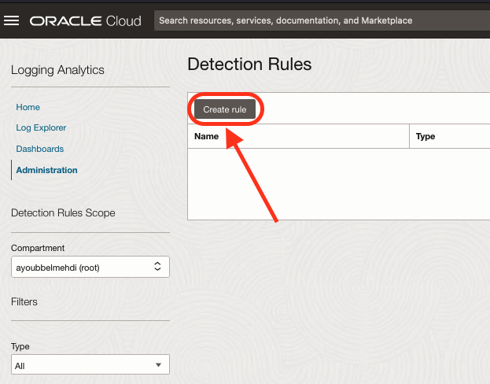
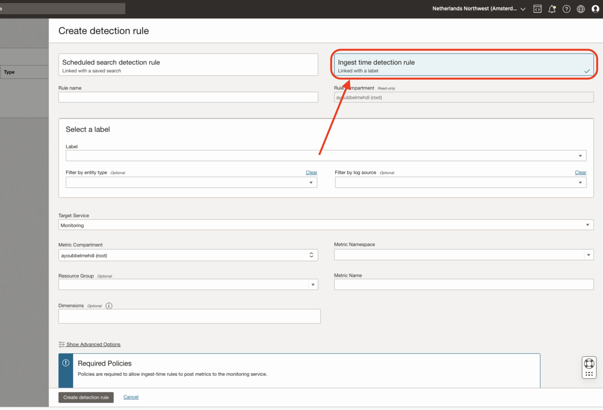
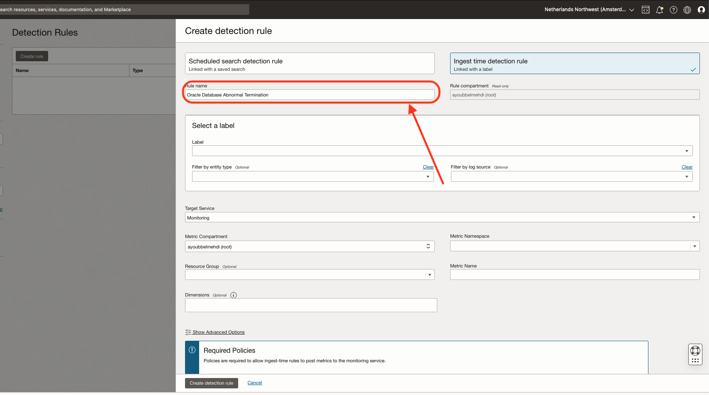
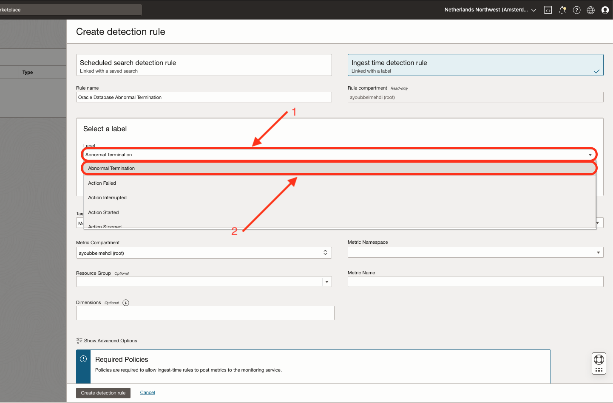
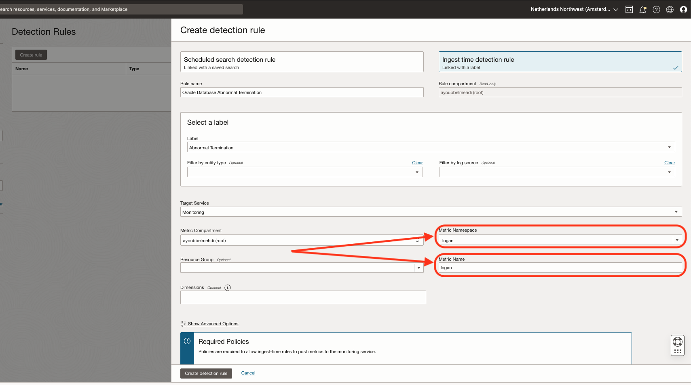
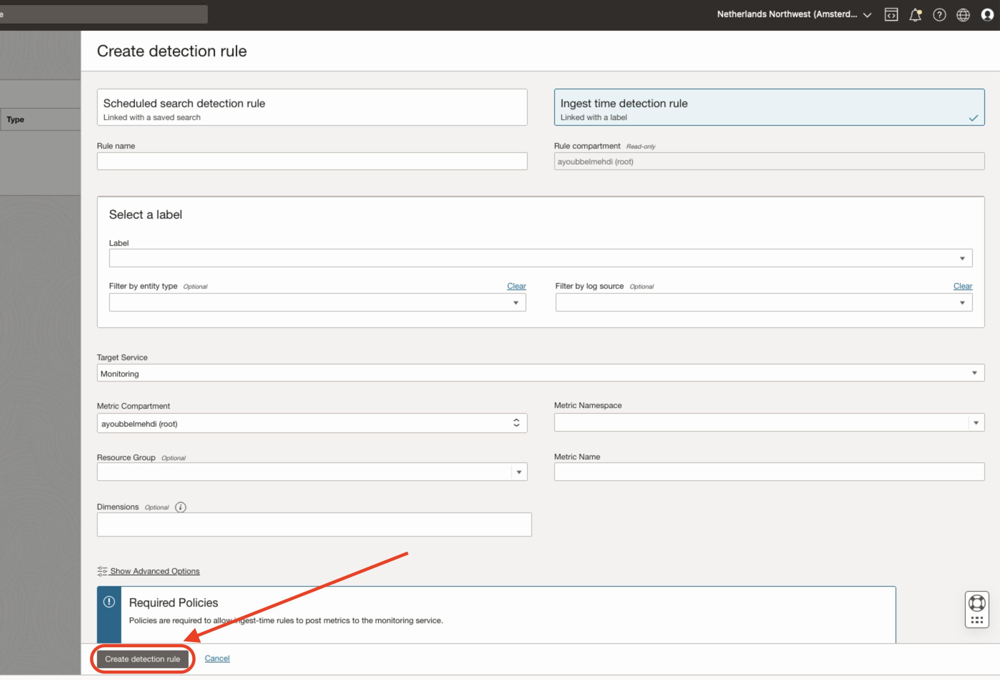
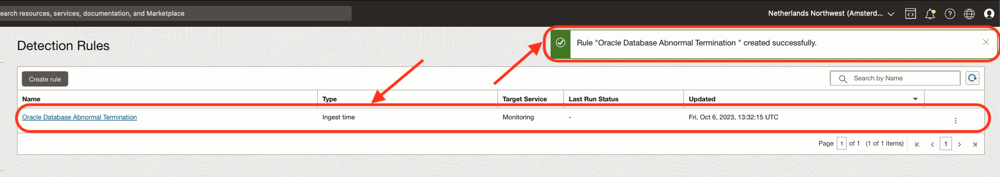

# Create detection rules

## Introduction

This lab will walk you through the steps to create Detection Rules for Oracle Database Abnormal Termination incident

Estimated Time: 5 minutes

### Objectives

In this lab, you will:

* Create a Detection Rule with an Oracle predefined OOTB label.

### Prerequisites

This lab assumes you have:

* An Oracle Cloud Infrastructure account

## Task 1: Navigate to Detection Rules Tab

Detection Rules can be found and defined in the Detection Rules Tab:

1. Step 1

  Open the  **Navigation Menu**
2. Step 2

  Open **"Observability & Management"** > In **"Logging Analytics"**, Click **"Administration"**.

  
3. Step 3

  In the Menu at bottom left, Click on "Detection Rules".

  

## Task 2: Create Detection Rules

1. Step 1

  Click on **"Create rule"** button.

  
2. Step 2

  Select **"Ingest time detection rule"**.

  
3. Step 3

  Insert a name in the **"Rule name"** field.

  
4. Step 4

  Under **"Select a label"** section > in **"Label"** input, Select **"Abnormal Termination"** label.

  
5. Step 5

  Fill "Metric Namespace" & "Metric Name" fields.

  
6. Step 6

  Save & Create the Detection Rule.

  

The Detection Rules creation pane will close and an info confirmation message should appear on screen if the rule was created, Otherwise you will need to correct the error(s) before the rule will be created.

## Learn More

* [Detect Predefined Events at Ingest Time](https://docs.oracle.com/en-us/iaas/logging-analytics/doc/detect-predefined-events-ingest-time.html#GUID-D28CF994-288F-48C3-8CE5-28CE29C3482C)

## Acknowledgements

* **Author:** Ayoub BELMEHDI, OCI Logging Analytics

* **Contributors:** Ashish GOR, Kiran PALUKURI, Vikram REDDY, Kumar Varun, OCI Logging Analytics

* **Last Updated By/Date:** Ayoub BELMEHDI, October 2023
